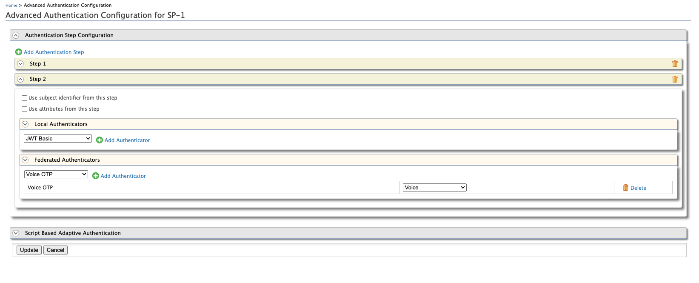
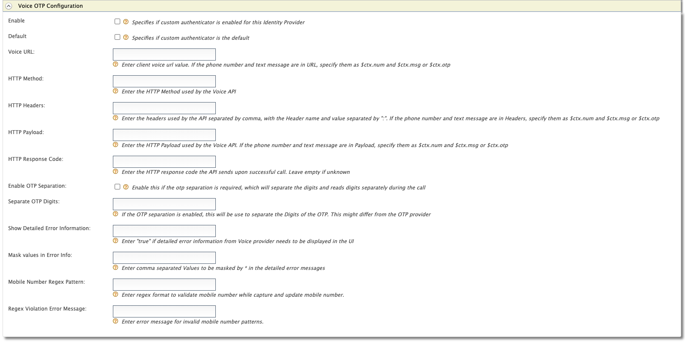

## VOICE OTP AUTHENTICATOR

The VoiceOTP authenticator allows you to authenticate user via otp which is delivered as a call to the user's mobile number configured.

# Setup

Download the org.wso2.carbon.extension.identity.authenticator.voiceotp.connector-{version}.jar and place it in <IS_HOME>/repository/components/dropins directory

# File based Configurations 

Add the below configurations to the deployment.toml file. 

Authenticator related configurations

```aidl
[authentication.authenticator.voice_otp]
name="VoiceOTP"
enable=true
parameters.VoiceOTPAuthenticationEndpointURL="authenticationendpoint/voiceOtp.jsp"
parameters.VoiceOTPAuthenticationEndpointErrorPage="authenticationendpoint/voiceOtpError.jsp"
parameters.MobileNumberRegPage="authenticationendpoint/voiceMobile.jsp"
parameters.RetryEnable=true
parameters.ResendEnable=true
parameters.BackupCode=true
parameters.VoiceOTPEnableByUserClaim=true
parameters.VoiceOTPMandatory=false
parameters.CaptureAndUpdateMobileNumber=true
parameters.SendOTPDirectlyToMobile=false
parameters.redirectToMultiOptionPageOnFailure=false
parameters.enable_payload_encoding_for_voice_otp=true
```
authenticationendpoint webapp related configurations 

```aidl
[[servlet]]
name="voice_otp.do"
jsp="/voiceOtp.jsp"
url="/voice_otp.do"

[[servlet]]
name="voice_otp_error.do"
jsp="/voiceOtpError.jsp"
url="/voice_otp_error.do"

[[servlet]]
name="voice_mobile.do"
jsp="/voiceMobile.jsp"
url="/voice_mobile.do"
```
# Create claims

1. Create "http://wso2.org/claims/identity/voiceotp_disabled" claim. 

* Go to management console -> claims -> Add -> Add Local Claim. 
* Enter "http://wso2.org/claims/identity/voiceotp_disabled" as the claim URI.
* Enter "voiceotp_disabled" as the Display Name  and Description.
* Add correct attribute mapping for this claim for the Primary userstore.

2. Create "http://wso2.org/claims/identity/failedVoiceOtpAttempts" claim similarly.
3. Create "http://wso2.org/claims/otpbackupcodes" claim similarly if it is not exists.
4. Create "http://wso2.org/claims/identity/failedLoginLockoutCount" claim similarly if it is not exists.
5. Create "http://wso2.org/claims/identity/accountLocked" claim similarly if it is not exists.
6. Create "http://wso2.org/claims/identity/unlockTime" claim similarly if it is not exists.
7. Create "http://wso2.org/claims/identity/lockedReason" claim similarly if it is not exists.

# Service provider based configurations

Add the voice otp authenticator to the authentication step from the Local & Outbound Authentication Configuration section.  



# IdP Configurations

Create a new IdP for the external Voice OTP provider with VoiceOTP authenticator. 

1. Tick "Enable" checkbox.
2. Enter the API endpoint URL of the voice otp provider as the "Voice URL"(Mandatory).The placeholders are $ctx.num which will be replaced with the user's mobile number and $ctx.otp which will replace with the otp .
3. Enter the REST API method name of the endpoint as the "Http Method"(Mandatory)
4. Enter the headers required(eg : Authorization header) to invoke the endpoint as the "HTTP Headers". The placeholders are $ctx.num which will be replaced with the user's mobile number and $ctx.otp which will replace with the otp .
5. Enter the payload with the placeholders if required for the endpoint as the "Http Payload". The placeholders are $ctx.num which will be replaced with the user's mobile number and $ctx.otp which will replace with the otp .
6. Enter the successful response code which will return from the Voice otp provider(eg : 200 , 201) as the "HTTP Response code". If nothing specifies in here, connector will check whether the response code is either 201,202,200 and consider all three as successful scenario.
7. If the "Enable OTP Separation" is enabled, the otp will be separated with the character that enters to the "Separate OTP Digits" section. Enabling this required if it is necessary to split and speak the numbers.
8. The "Separate OTP Digits" section represents the character which needs to be added between the otp numbers before sending to the Voice OTP provider. For example, by default it will have "%2B" which represents URL encoded space character. 
9. The "Divisor value" represents how the otp number separation should be handled. For example the default value is 1 and it will add the separation character explains in 6th point between every number. Eg: 1%2B2%2B3%2B4%2B5%2B6. If the divisor value is two it will be like 12%2B34%2B56. And it will speak like "TWELVE THIRTYFOUR FIFTYSIX" during the call.
10. Enter true for the "Show Detailed Error Information" section if you need detailed error message.
11. Enter any comma separated values to the "Mask values in Error Info " section, if you need some error text needs to be masked with "*".
12. Enter the regex pattern in the "Mobile Number Regex Pattern" section, if it is required to validate the mobile number pattern when capturing and updating the mobile number during the authentication(When user doesn't have a mobile number configured in the user profile).
13. Enter error message for invalid mobile number pattern in the "Regex Violation Error Message" section.



# JSP files to the authenticationendpoint webapp

Download the below jsp files and place them inside the <IS_HOME>/repository/deployment/server/webapps/authenticationendpoint webapp.

1. [voiceOtp.jsp](../component/authenticator/src/webapp/voiceOtp.jsp) 
2. [voiceOtpError.jsp](../component/authenticator/src/webapp/voiceOtpError.jsp)
3. [voiceMobile.jsp](../component/authenticator/src/webapp/voiceMobile.jsp)

# authenticationendpoint webapp resources.properties content

Remove the "SMS OTP" related properties(Under the # SMS OTP line) which in the bottom of the file[1] and append the below content to the file[1].
If you are using the other language properties, It is required to add the translated content of the below configurations to those files as well(Eg : Resources_fr_FR.properties file). 

[1]<IS_HOME>/repository/deployment/server/webapps/authenticationendpoint/WEB-INF/classes/org/wso2/carbon/identity/application/authentication/endpoint/i18n/Resources.properties

```aidl
# SMS OTP
enter.code.sent.smsotp=Enter the code sent to your mobile phone:
auth.with.smsotp=Authenticating with SMSOTP
error.send.smsotp=Unable to send code to your phone number
error.failed.with.smsotp=Failed Authentication with SMSOTP
error.smsotp.disabled=Enable the SMS OTP in your Profile. Cannot proceed further without SMS OTP authentication.
error.user.not.found.smsotp=User not found in the directory. Cannot proceed further without SMS OTP authentication.

# Voice OTP
enter.code.sent.voiceotp=Enter the code sent to your mobile phone:
auth.with.voiceotp=Authenticating with VoiceOTP
error.send.voiceotp=Unable to send code to your phone number
error.failed.with.voiceotp=Failed Authentication with VoiceOTP
error.voiceotp.disabled=Enable the Voice OTP in your Profile. Cannot proceed further without Voice OTP authentication.
error.user.not.found.voiceotp=User not found in the directory. Cannot proceed further without Voice OTP authentication.


# SMS OTP & Voice OTP
error.code.expired.resend=The code entered is expired. Click Resend Code to continue.
error.wrong.code=The code entered is incorrect. Authentication Failed!
error.token.expired=The code entered is expired. Authentication Failed!
error.token.expired.email.sent=The code entered is expired. Please check inbox for a new OTP.
authenticate.button=Authenticate
please.enter.code=Please enter the code!
enter.phone.number=Enter Your Mobile Phone Number
```

# Finally 

Restart the server and test the authentication flow. 